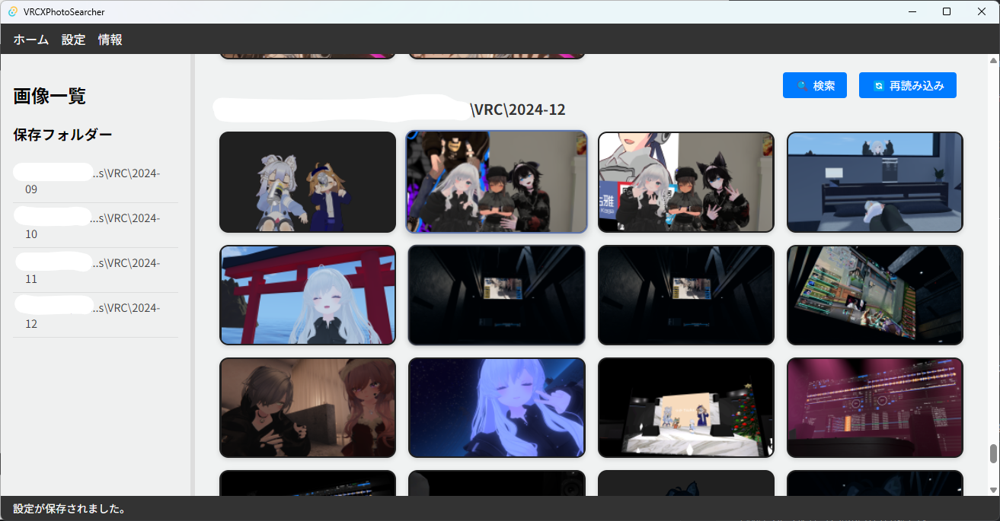
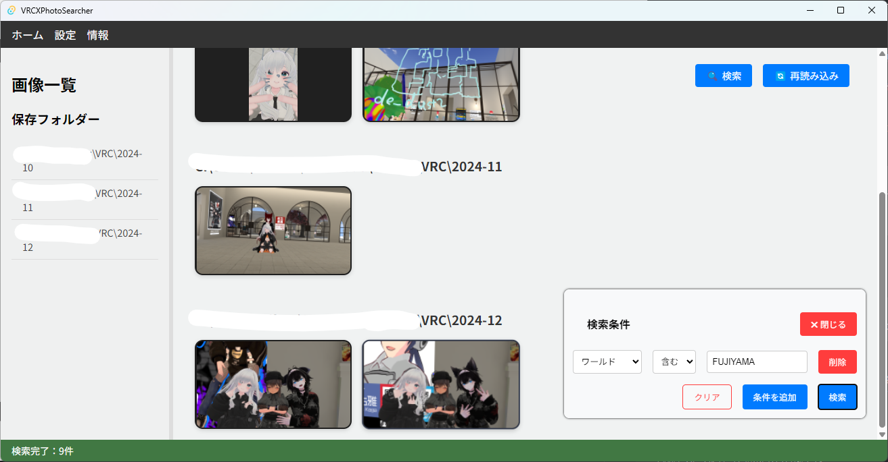
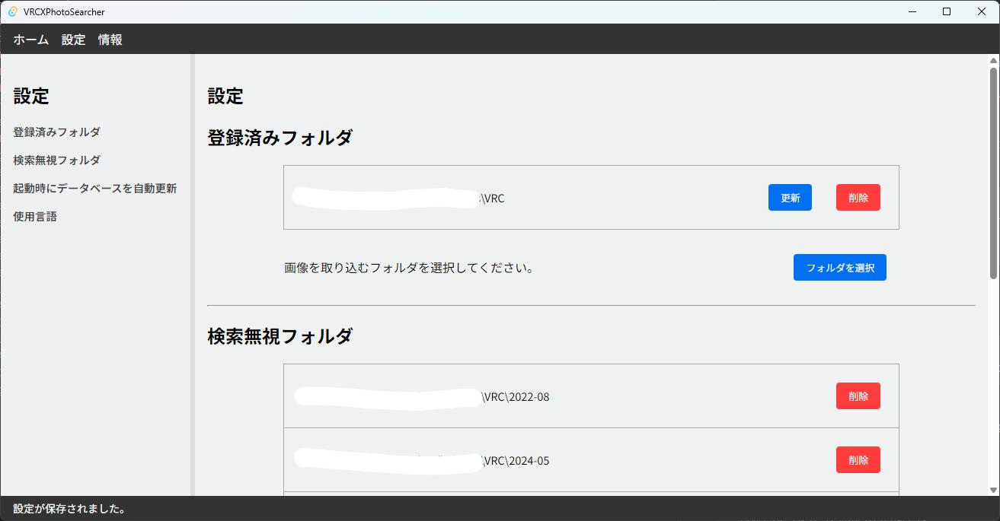

# VRCXPhotoSearcher

**VRCXPhotoSearcher** は、VRChat のスクリーンショット・ギャラリーを整理したり、素早く検索するためのツールです。
このプロジェクトは、VRChatプレイヤー向けに特化しており、過去に撮影された写真へのアクセスを改善します。

### 概要

このプログラムは、VRChatの外部アプリケーションである **[VRCX](https://github.com/vrcx-team/VRCX/)** と連携して動作します。
具体的には、VRChatでスクリーンショットを撮影した際に、**VRCX** によって保存されるメタデータを解析し、その情報を基に写真を検索できる機能を提供します。

  

    
    
Screenshot

  

  

    
    
Search

  

  

    
    
settings

  

### 特徴

- **VRCXのメタデータを解析**
  VRChatで撮影されたスクリーンショットと、それに関連付けられた**VRCX**のメタデータ（ユーザー名、ワールド名）を解析し、効率的な整理と検索をサポートします。
- **多機能な検索機能**
  撮影日、ワールド名、ユーザー名の複数の条件を組み合わせた検索が可能。必要な写真を素早く見つけられます。
- **直感的なユーザーインターフェース**
  シンプルで使いやすいデザインで、誰でも簡単に操作できます。
- **PNGフォーマットに対応**
  VRCXがメタデータを保存するスクリーンショット画像（PNGフォーマット）にで動作します。
- **効率的なフォルダ構成の解析**
  複数のフォルダに分散して保存された写真データを一括で整理・確認することが可能です。
- **軽量で高速**
  RustとTauriで開発され、軽量かつ高速に写真を検索・表示します
- **安全な操作**
  画像データやメタデータはローカルで処理されるため、インターネット経由でデータが共有されません。

### 使い方

以下の手順に従って、**VRCXPhotoSearcher** を利用してください。

#### 1. **VRCXのインストールと設定**

本ツールは、VRCXが保存するスクリーンショットのメタデータを利用して動作します。事前にVRCXをインストールし、スクリーンショットフォルダの保存先を設定してください。

- VRCXでスクリーンショットを撮影すると、PNG画像にメタデータが自動で保存されます。

#### 2. **本ツールのインストール**

提供されるインストール手順（配布されたバイナリまたはソースコードからのビルド手順）に従い、**VRCXPhotoSearcher** をセットアップします。

#### 3. **初回起動時の注意**

最初に指定するスクリーンショットフォルダ内に膨大なファイルが含まれる場合、データの読み込みやインデックス作成に時間がかかる場合があります。
以下を事前に設定することで、スムーズな動作が期待できます。

- **除外フォルダを設定する**
  不要なスクリーンショットが保存されているフォルダをあらかじめ除外フォルダとして指定してください（例: 古いバックアップフォルダやテスト用写真フォルダなど）。
  **特にVRCXインストール以前のフォルダは写真管理はできますが、メタデータがないため、検索しても引っかかることがないので注意してください。**
  **また、`VRC/`を直接指定するよりも`VRC/2024-12`のようなフォルダ単位で指定することをおすすめします。新しい写真を撮った時にデータベースの更新をしないと反映されませんが、現状では個別の登録したフォルダ単位での更新となるためその時間が膨大になるためです。**
- **スキャン範囲の絞り込み**
  ファイル数が非常に多い場合、必要な写真だけを含む特定のフォルダに絞るなどの工夫をしてください。

#### 4. **スクリーンショットフォルダを設定**

ツールを起動すると、スクリーンショットフォルダ（通常は `<ユーザーのピクチャフォルダ>/VRChat`）のパスを指定するよう求められます。このフォルダがツールの検索対象となります。設定が完了すると、ツールはフォルダ内の写真を自動的に読み込みます。

#### 5. **全画像一覧の表示**

初回起動後や検索条件を指定していない状態では、**すべてのスクリーンショット画像が一覧表示**されます。

- 一覧には画像のサムネイルが表示されます。
- サムネイルをクリックすると、その写真の詳細情報が表示されます。

#### 6. **写真の詳細を確認する**

サムネイルをクリックすると、写真の詳細情報を確認できる画面が表示され、以下の操作が可能です：

1. **写真のプレビュー**
   選択した写真が拡大表示されます。
2. **保存パスの確認と表示**
   写真が保存されているパスが表示され、対応するリンクをクリックすると標準の画像ビューアで写真を開けます。
3. **ワールド名の確認**
   この写真が撮影されたVRChatのワールド名が表示されます。

   - ワールド名をクリックすると、VRChat公式ウェブサイトのワールド詳細ページを開けます。
   - 同時に、このワールド名を検索条件に追加することも可能です。

4. **ユーザーリストの確認**
   写真に関連するユーザー名の一覧が表示されます。
   - 各ユーザー名をクリックすると、そのユーザーの詳細ページをVRChat公式ウェブサイトで確認できます。
   - また、ユーザー名をクリックして検索条件に追加することも可能です。

#### 7. **検索機能を利用する**

写真の詳細画面や検索バーから、以下の条件を使用して絞り込み検索できます：

- **撮影日**: 年月日での検索
- **ワールド名**: 撮影ワールド名での検索
- **ユーザー名**: 写真に映っているユーザー名での検索

こちらの条件を組み合わせて検索することも可能です。

### インストール方法

**VRCXPhotoSearcher** を利用するには、[Githubのリリースページ](https://github.com/Saffrontea/VRCXPhotoSearcher/releases)からバイナリをDLしてください。

#### 注意事項

- 本ツールを使用する前に、VRCXを正しく設定してください。
- 初めて使用する際には、スクリーンショットフォルダにアクセス権があることを確認してください。
