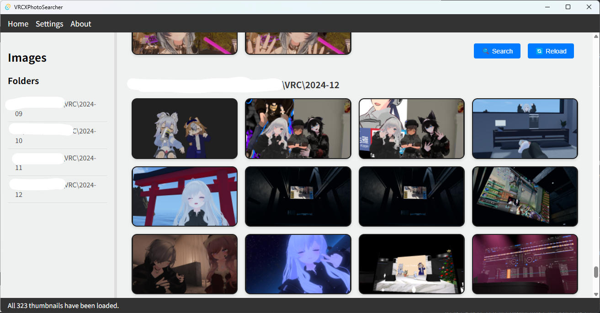
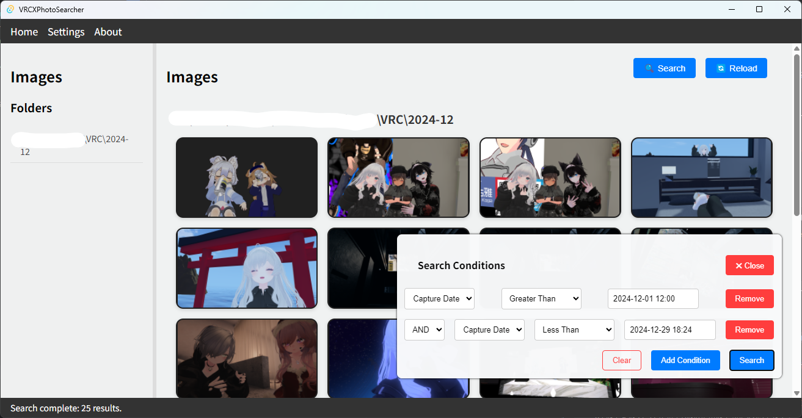
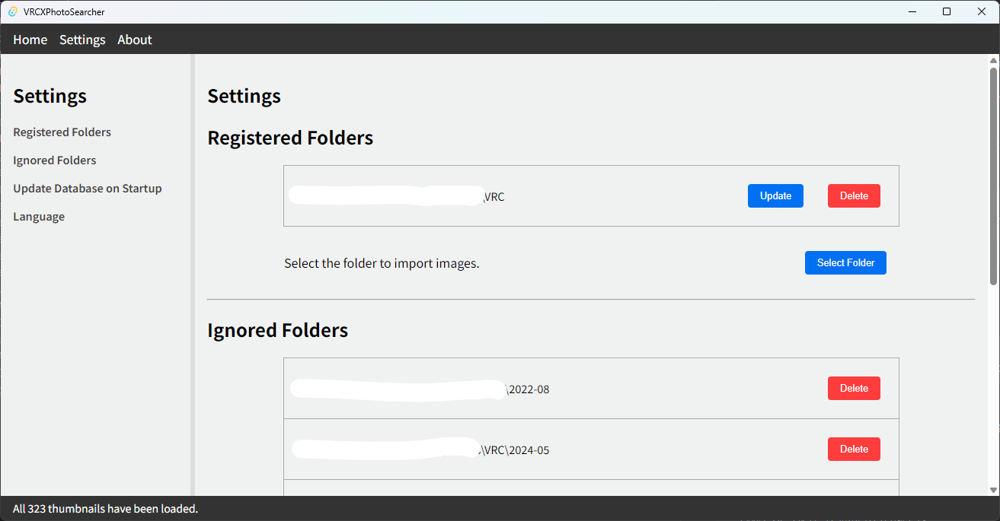

# VRCXPhotoSearcher

{:toc}

**VRCXPhotoSearcher** is a tool for organizing and quickly searching through your VRChat screenshot gallery.  
This project is specifically designed for VRChat players to improve accessibility to photos captured in the past.

[日本語版READMEはこちら](./README_ja.md)

---

### Overview

This program works in conjunction with **[VRCX](https://github.com/vrcx-team/VRCX/)**, an external application for VRChat.  
Specifically, it analyzes metadata saved by **VRCX** when screenshots are taken in VRChat. The tool enables users to search for photos based on the associated metadata like usernames and world names.

<div style="display: flex; gap: 10px;">
  <div>
    
    <p>Screenshot</p>
  </div>
  <div>
    
    <p>Search</p>
  </div>
  <div>
    
    <p>settings</p>
  </div>
</div>

### Features

- **Analysis of VRCX Metadata**:  
  Efficiently organizes and searches VRChat screenshots using metadata such as usernames and world names.

- **Advanced Search Features**:  
  Search photos by conditions such as _capture date_, _world name_, and _usernames_. Combine multiple conditions for quick access.

- **User-friendly Interface**:  
  Simple and intuitive design for ease of use.

- **Support for PNG Format**:  
  Operates on screenshots in PNG format with metadata saved by VRCX.

- **Efficient Folder Analysis**:  
  Consolidates and allows easy access to photo data stored across multiple folders.

- **Lightweight and Fast**:  
  Developed with Rust and Tauri, it offers fast and lightweight performance for searching and displaying photos.

- **Secure Local Operations**:  
  All image and metadata processing happens locally without sharing over the internet.

### How to Use

#### Step 1: Install and Configure VRCX

This tool relies on metadata from screenshots that are saved by VRCX. Please install and configure VRCX in advance and set the screenshots folder.

- Screenshots taken in VRChat will automatically generate corresponding metadata in the png file when VRCX is set up.

#### Step 2: Install VRCXPhotoSearcher

Follow the provided installation guide (download a pre-built binary or build from source) to set up VRCXPhotoSearcher.

#### Step 3. **Notes on Initial Launch**

If the registred screenshot folder contains a large number of files, loading data and creating an index may take some time. Setting up the following in advance can ensure smoother operation:

- **Set Excluded Folders**  
  Specify folders containing unnecessary screenshots as excluded folders in advance (e.g., old backup folders or test photo folders).  
  **Note that folders created before VRCX installation can be managed, but since they lack metadata, they will not appear in searches.**  
  **Additionally, instead of specifying `VRC/` directly, it is recommended to specify folders like `VRC/2024-12`. While new photos will not be reflected unless the database is updated, the current implementation requires updates on a per-folder basis, which could take significant time.**

- **Narrow the Scanning Range**  
  If the number of files is extremely large, consider limiting the scope to specific folders containing only the necessary photos.


#### Step 4: Set Screenshot Folder

When the program starts for the first time, specify the folder containing your VRChat screenshots (commonly `<Your Pictures Folder>/VRChat`). Once set, the program will automatically load photo data from the folder.


#### Step 5: Browse All Images

When no search criteria are specified, the program will display all the screenshots in a list.

- Image thumbnails are displayed.
- Clicking on a thumbnail opens detailed photo information.

#### Step 6: View Photo Details

Clicking a thumbnail allows you to view more detailed information about the photo, including:

1. **Photo Preview**: Displays an enlarged view of the selected photo.
2. **Saved Path**: Shows the file path to the photo. Clicking the path opens it in your default image viewer.
3. **World Name**: Displays the name of the VRChat world where the photo was taken, with options to:
   - Open the world's details on the official VRChat site.
   - Add the world name as a search filter.
4. **Associated Usernames**: Shows usernames detected in the metadata, with options to:
   - View the user's VRChat profile page on the official site.
   - Add usernames as search filters.

#### Step 7: Use Advanced Search

Filter photos based on the following conditions, alone or in combination:

- **Capture Date**: Search by specific dates (year, month, day).
- **World Name**: Search photos taken in specific VRChat worlds.
- **Username**: Search for photos containing specific usernames.

---

### Installation

#### From Prebuilt Binary

1. Download the appropriate binary file for your operating system via the [GitHub Releases page](https://github.com/username/VRCXPhotoSearcher/releases).
2. Extract the file into your desired directory.
3. Run the program. If a warning about untrusted software appears, set it as trusted or allow access.

#### From Source

1. Ensure you have Rust installed ([Rust Installation Guide](https://www.rust-lang.org/tools/install)).
2. Clone the repository:
   ```cmd
   git clone https://github.com/username/VRCXPhotoSearcher.git
   cd VRCXPhotoSearcher
   ```
3. Install dependencies:
   ```cmd
   cargo install
   ```
4. Build the application:
   ```cmd
   cargo build --release
   ```
5. Use the executable from the `target/release` folder.

---

For the Japanese README, refer to:  
[日本語版READMEはこちら](./README.ja.md)
